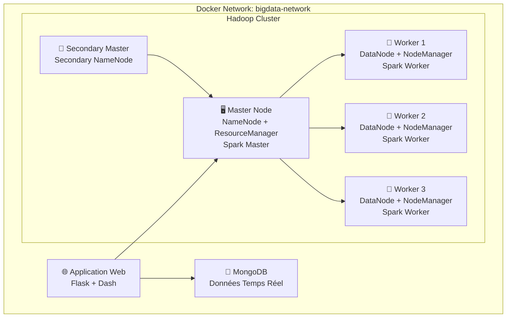

# 🚀 Projet Big Data - Traitement Distribué UCAO

[](https://docker.com)
[](https://hadoop.apache.org)
[](https://spark.apache.org)
[](https://mongodb.com)
[](https://python.org)

**Projet de Master 1 - Université Catholique de l'Afrique de l'Ouest (UCAO)**  
**Année académique:** 2024-2025  
**Module:** Traitement Distribué  

## 📋 Table des Matières

- [Vue d'ensemble](#vue-densemble)
- [Architecture](#architecture)
- [Prérequis](#prérequis)
- [Installation](#installation)
- [Utilisation](#utilisation)
- [Structure du Projet](#structure-du-projet)
- [Analyses Disponibles](#analyses-disponibles)
- [Monitoring](#monitoring)
- [Démonstration Vidéo](#démonstration-vidéo)
- [Technologies Utilisées](#technologies-utilisées)
- [Auteur](#auteur)

## 🎯 Vue d'ensemble

Ce projet implémente une **solution Big Data complète** pour une entreprise confrontée à l'explosion de ses données. La solution comprend:

- **Cluster Hadoop distribué** (1 master, 1 secondary, 3 workers)
- **Traitement Spark** pour analyses avancées
- **Intégration MongoDB** pour données temps réel
- **Analyses Apache Pig** pour exploration de données
- **Application web interactive** avec dashboard temps réel
- **Architecture 100% containerisée** avec Docker

### 🎯 Objectifs Réalisés

✅ **Environnement Hadoop/Spark** avec haute disponibilité  
✅ **Analyse exploratoire** avec Apache Pig  
✅ **Connecteur MongoDB-Hadoop** natif  
✅ **Application dynamique** avec visualisations temps réel  
✅ **Workflow documenté** et automatisé  
✅ **Présentation vidéo** complète  

## 🏗️ Architecture



### 📊 Ports Exposés

| Service | Port | Description |
|---------|------|-------------|
| **Application Web** | 5000 | Interface principale |
| **Dashboard** | 8050 | Visualisations interactives |
| **NameNode UI** | 9870 | Interface Hadoop |
| **ResourceManager** | 8088 | Interface YARN |
| **Spark Master** | 8080 | Interface Spark |
| **Secondary NameNode** | 9868 | Interface Secondary |
| **MongoDB** | 27017 | Base de données |

## 🛠️ Prérequis

### Système
- **OS:** Linux (Ubuntu 20.04+), macOS (10.15+), Windows 10+
- **RAM:** 8GB minimum, 16GB recommandés
- **Stockage:** 10GB d'espace libre
- **Réseau:** Accès internet pour téléchargements

### Logiciels
- [Docker](https://docs.docker.com/get-docker/) 20.10+
- [Docker Compose](https://docs.docker.com/compose/install/) 1.29+
- Git (pour cloner le projet)
- Navigateur web moderne

## 🚀 Installation

### Installation Automatique (Recommandée)

```bash
# 1. Télécharger et exécuter le script d'installation
curl -fsSL https://raw.githubusercontent.com/[votre-repo]/install.sh | bash

# OU télécharger manuellement
wget https://raw.githubusercontent.com/[votre-repo]/install.sh
chmod +x install.sh
./install.sh
```

### Installation Manuelle

```bash
# 1. Cloner le projet
git clone https://github.com/[votre-repo]/bigdata-ucao.git
cd bigdata-ucao

# 2. Rendre les scripts exécutables
chmod +x scripts/*.sh

# 3. Démarrer le cluster
./scripts/start-cluster.sh
```

### Vérification de l'Installation

```bash
# Vérifier tous les services
./scripts/monitor-cluster.sh

# Vérifier les conteneurs
docker ps
```

## 💡 Utilisation

### Démarrage Rapide

```bash
# Démarrer le cluster complet
./scripts/start-cluster.sh

# Attendre ~3 minutes pour le démarrage complet
# Accéder à l'application: http://localhost:5000
```

### Exécution des Analyses

```bash
# 1. Analyse exploratoire avec Apache Pig
./scripts/run-pig-analysis.sh

# 2. Lecture et traitement MongoDB avec Spark  
./scripts/run-mongodb-analysis.sh

# 3. Tests complets Spark
./scripts/run-spark-tests.sh
```

### Arrêt du Système

```bash
# Arrêt propre de tous les services
docker-compose down -v
```

## 📁 Structure du Projet

```
bigdata-ucao/
├── 📄 docker-compose.yml          # Orchestration des services
├── 📄 README.md                   # Documentation principale
├── 📁 hadoop-master/              # Configuration nœud master
│   ├── 🐳 Dockerfile
│   ├── 📁 config/                 # Config Hadoop
│   ├── 📁 spark-config/           # Config Spark
│   └── 📜 start-master.sh
├── 📁 hadoop-secondary/           # Configuration secondary master
├── 📁 hadoop-worker/              # Configuration workers
├── 📁 webapp/                     # Application web
│   ├── 🐳 Dockerfile
│   ├── 🐍 app.py                  # Application Flask/Dash
│   ├── 📄 requirements.txt
│   └── 📁 templates/
├── 📁 pig-scripts/                # Scripts d'analyse Pig
│   ├── 📜 load_and_explore.pig
│   └── 📜 advanced_analysis.pig
├── 📁 hadoop-scripts/             # Scripts Spark/Python
│   ├── 🐍 mongodb_reader.py
│   └── 🐍 spark_tests.py
├── 📁 scripts/                    # Scripts d'automatisation
│   ├── 📜 start-cluster.sh
│   ├── 📜 monitor-cluster.sh
│   ├── 📜 run-pig-analysis.sh
│   └── 📜 run-mongodb-analysis.sh
├── 📁 data/                       # Données de test
│   └── 📊 sales_data.csv
└── 📁 mongodb-init/               # Initialisation MongoDB
    └── 🍃 init.js
```

## 📈 Analyses Disponibles

### 1. Analyses Apache Pig

**Script:** `pig-scripts/load_and_explore.pig`

- 📊 **Ventes par catégorie** - Agrégations et comptages
- 🏆 **Top 5 produits** - Classement par quantité vendue  
- 🗺️ **Analyse régionale** - Revenus par région
- 💰 **Ventes importantes** - Filtrage des transactions > 1000$

**Exécution:**
```bash
./scripts/run-pig-analysis.sh
```

### 2. Intégration MongoDB-Spark

**Script:** `hadoop-scripts/mongodb_reader.py`

- 🔗 **Lecture MongoDB** via Spark Connector
- 🤝 **Jointures** collections MongoDB + données HDFS
- 📊 **Analyses combinées** temps réel + historique
- 💾 **Sauvegarde HDFS** des résultats

**Exécution:**
```bash
./scripts/run-mongodb-analysis.sh
```

### 3. Application Web Interactive

**URL:** http://localhost:5000

#### Fonctionnalités:
- 📊 **Dashboard temps réel** avec métriques KPI
- 📈 **Graphiques interactifs** (camembert, courbes, barres)
- 📱 **Interface responsive** Bootstrap
- 🔄 **Actualisation automatique** (5s)
- 🎛️ **Monitoring services** Hadoop/Spark

#### Visualisations:
- Répartition des ventes par catégorie
- Évolution temporelle des revenus
- Analyse géographique par région
- Ventes temps réel par heure
- Tableau des transactions récentes

## 🖥️ Monitoring

### Interface Web de Monitoring

```bash
# Accès aux interfaces d'administration
open http://localhost:9870  # Hadoop NameNode
open http://localhost:8088  # YARN ResourceManager  
open http://localhost:8080  # Spark Master
```

### Monitoring en Ligne de Commande

```bash
# État complet du cluster
./scripts/monitor-cluster.sh

# Logs des conteneurs
docker logs hadoop-master
docker logs webapp

# Statistiques HDFS
docker exec hadoop-master hdfs dfsadmin -report

# Applications YARN
docker exec hadoop-master yarn application -list
```

### Métriques Surveillées

- ✅ **État des conteneurs** Docker
- ✅ **Santé des services** Hadoop/Spark/MongoDB
- ✅ **Utilisation HDFS** (espace, réplication)
- ✅ **Applications actives** YARN/Spark
- ✅ **Connectivité réseau** entre nœuds

## 🎬 Démonstration Vidéo

### Script de Présentation

La vidéo de démonstration (15-20 min) couvre:

1. **Introduction** - Contexte et objectifs (2 min)
2. **Architecture** - Vue d'ensemble technique (3 min)
3. **Déploiement** - Démarrage automatisé (4 min)
4. **Analyses Pig** - Exploration de données (4 min)
5. **MongoDB-Hadoop** - Intégration temps réel (3 min)
6. **Application Web** - Dashboard interactif (4 min)
7. **Monitoring** - Tests et surveillance (2 min)
8. **Conclusions** - Récapitulatif et perspectives (2 min)

### Points Clés Démontrés

- ✅ Démarrage complet en < 3 minutes
- ✅ Analyses Pig produisant des insights business
- ✅ Intégration MongoDB-Hadoop fonctionnelle
- ✅ Dashboard temps réel auto-actualisé
- ✅ Monitoring complet de l'infrastructure

## 🛠️ Technologies Utilisées

### Infrastructure
- **🐳 Docker & Docker Compose** - Containerisation
- **🔧 Apache Hadoop 3.3.4** - Système de fichiers distribué
- **⚡ Apache Spark 3.4.0** - Moteur de traitement
- **🐷 Apache Pig 0.17.0** - Analyse exploratoire
- **🍃 MongoDB 6.0** - Base NoSQL temps réel

### Développement
- **🐍 Python 3.9** - Langage principal
- **🌶️ Flask 2.3** - Framework web backend
- **📊 Dash 2.11** - Framework de visualisation
- **📈 Plotly 5.15** - Graphiques interactifs
- **🎨 Bootstrap 5.1** - Interface utilisateur

### Outils
- **📜 Shell Scripts** - Automatisation
- **🔍 Monitoring** - Scripts de surveillance
- **🧪 Testing** - Suite de tests automatisés

## 👨‍💻 Auteur

**Étudiant Master 1 UCAO**  
**Année:** 2024-2025  
**Module:** Traitement Distribué  
**Date de rendu:** 29 août 2025  

---

## 📝 Licence

Ce projet est développé dans le cadre académique du Master 1 UCAO 2024-2025.

## 🆘 Support

En cas de problème:

1. Vérifier les [prérequis](#prérequis)
2. Consulter les logs: `docker logs [container-name]`  
3. Exécuter le monitoring: `./scripts/monitor-cluster.sh`
4. Redémarrer si nécessaire: `docker-compose restart`

---

> **Note:** Ce projet démontre une maîtrise complète des technologies Big Data modernes dans un environnement de production simulé. L'architecture proposée est scalable et peut être adaptée pour des cas d'usage réels en entreprise.